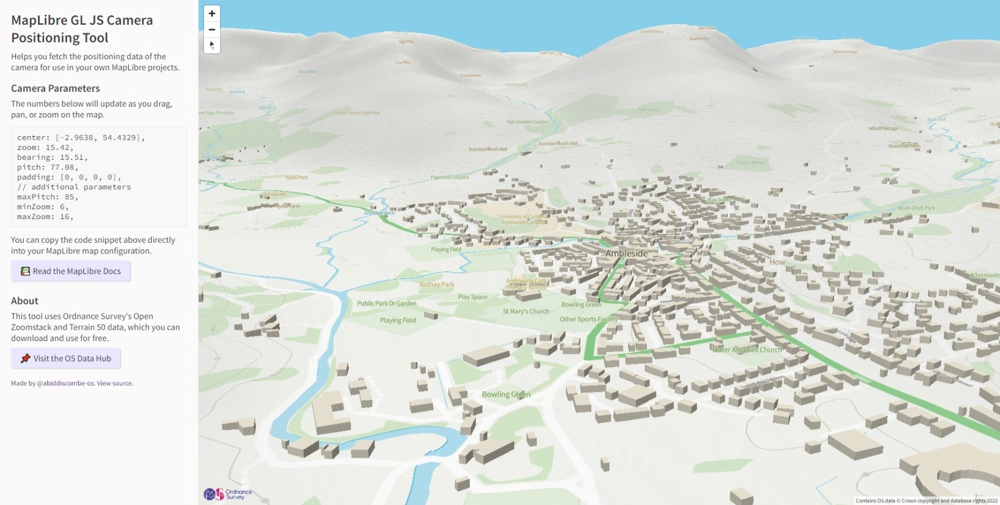

# mlCameraPosition
A handy tool to help you fetch the positioning data of the camera for use in your own MapLibre projects.

> **Note**  
> Check out the [Live Demo](https://abiddiscombe-os.github.io/mlCameraPosition/) to see this tool in action!

## What is it?
In short, it's a simple MapLibre GL JS web map, that uses Ordnance Survey datasets (Open Zoomstack, Terrain 50) with the new terrain features of MapLibre 2.2 to provide information on the 3D parameters of the active scene.

If you're working on a 3D map, you'll know the challenges of trying to set the center point, bearing, and pitch of the camera (what the user sees) for the initial load of the map. I've made this tool to help simplify this process, just copy and paste the code snippet into your map to replicate the viewshed.



## Example

```javascript
map = new maplibregl.Map({
    container: 'map',
    style: 'your-style-url',

    // PASTE CODE SNIPPET BELOW
    center: [-2.9638, 54.4329],
    zoom: 15.42,
    bearing: 15.51,
    pitch: 77.08,
    padding: [0, 0, 0, 0],
    
    // ADDITIONAL PARAMETERS
    maxPitch: 85,
    minZoom: 6,
    maxZoom: 16
    
    // FOR YOUR INFORMATION
    // The maxPitch value is specified to give greater flexibility
    // MapLibre limits pitch to 60 degrees by default, values above this are experimental

});
```

Feel free to fork and play about with the code, but please note **the data sources and styles used in this application are restricted for Ordnance Survey use only, please use your own hosted content or our APIs via the OS Data Hub**, thank you.
