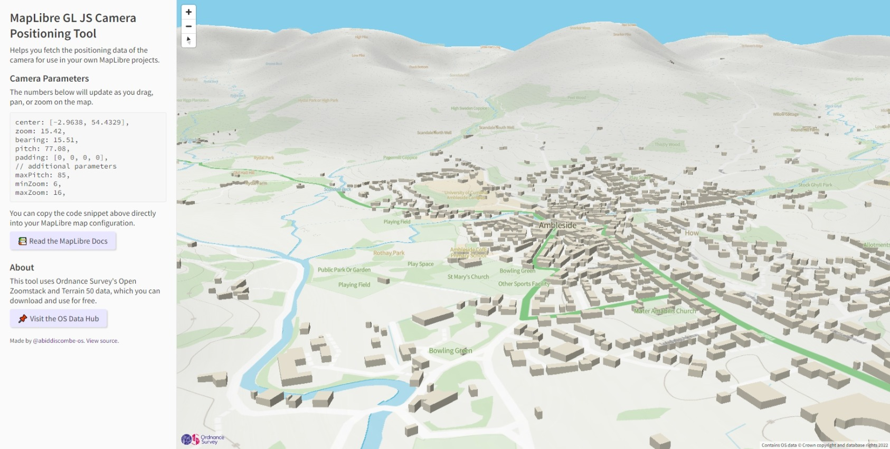

# mlCameraPosition
A handy tool to help you fetch the positioning data of the camera for use in your own MapLibre projects. [Check it out here](https://abiddiscombe-os.github.io/mlCameraPosition/), thanks to GitHub Pages.



## What is it?
In short, it's a simple MapLibre GL JS web map, that uses Ordnance Survey datasets (Open Zoomstack, Terrain 50) with the new terrain features of MapLibre 2.2 to provide information on the 3D parameters of the active scene.

## Why would I want to use it?
If you're making a fancy 3D map, you'll know the challenges of trying to set the center point, bearing, and pitch of the camera (what the user sees) for the initial load of the map. I've made this tool to help simplify this process, just copy and paste the code snippet into your map, for example:

```
map = new maplibregl.Map({
    container: 'map',
    style: 'your-style-url',

    // PASTE CODE SNIPPET BELOW
    center: [-2.9638, 54.4329],
    zoom: 15.42,
    bearing: 15.51,
    pitch: 77.08,
    padding: [0, 0, 0, 0],
    
    // additional parameters
    maxPitch: 85,
    minZoom: 6,
    maxZoom: 16,

});
```

The maxPitch value is specified to give you greater flexibility. By default, MapLibre limits pitch to 60 degrees, **because values beyond this are still experimental**.

## To-Do
This tool is still in development, future changes may break existing content.

Feel free to fork and play about with the code, however please note **the data sources and styles used in this application are restricted for Ordnance Survey use only, please use your own hosted content or our APIs via the OS Data Hub**, thank you.

- Add geocoding functionality.
- Limit bounds to GB, or provide an alternative basemap for non-GB users.
- Add dark theme for night owls.